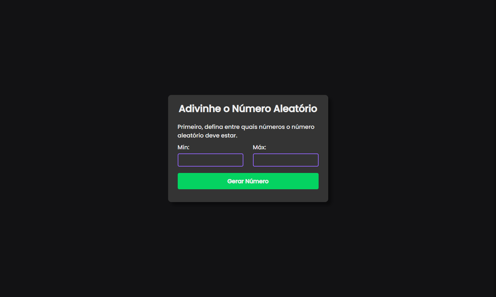
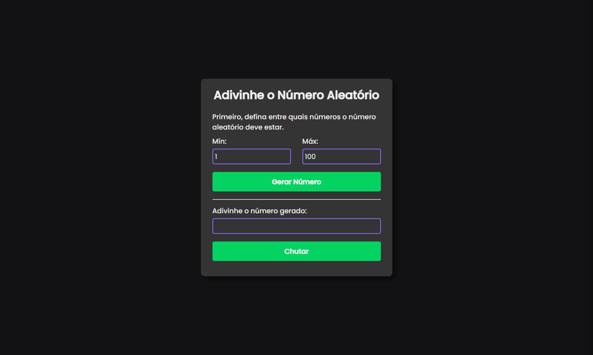
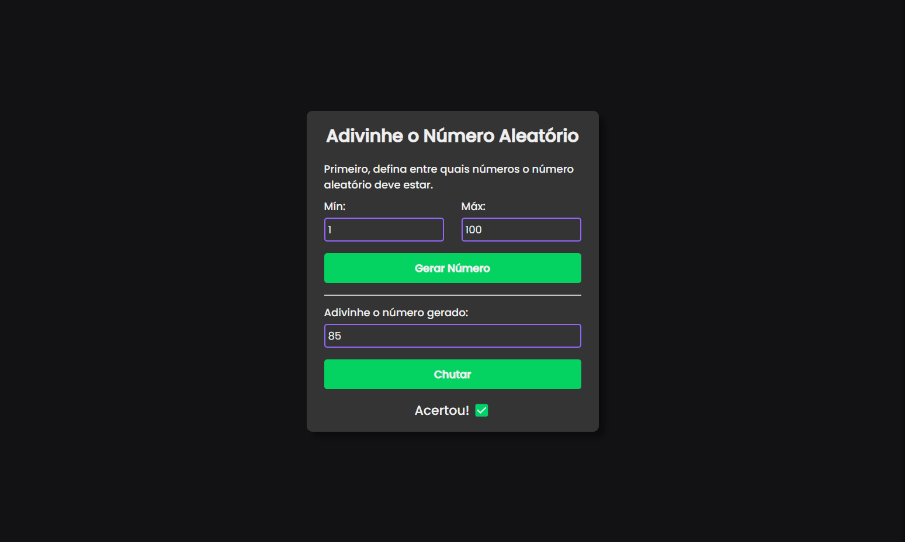

# Adivinhe o Número 🔢
O Adivinhe o Número é uma aplicação onde você pode brincar de adivinhar o número gerado aleatoriamente com o range que você mesmo coloca!

O projeto foi desenvolvido para evoluir os conhecimentos em JavaScript.

## Screen da parte de definir um range para o número aleatório ⬇️

## Screen da parte de tentar adivinhar o número aleatório ⬇️

## Screen da parte de feedback do game ⬇️

[ 🔗 Clique aqui para acessar](https://joaoliveirapb.github.io/adivinhe-numero-aleatorio/)

## 🛠️ Tecnologias
- JavaScript
- HTML
- CSS

## 💙 Contato
Criado por João Oliveira

